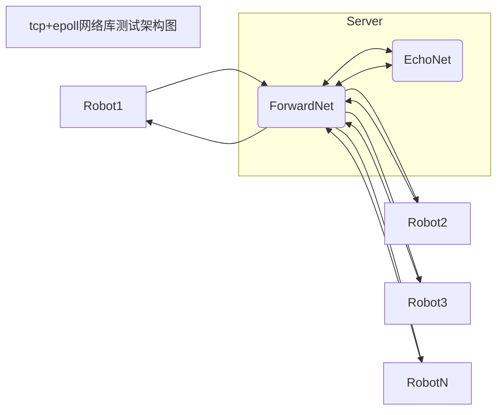

## 1. 网络库架构图
    // TODO
## 2. 网络库测试数据
### 2.1 Tcp+epoll 承载能力测试
#### 2.1.1 回声模型测试
#### 2.1.2 回声+转发模型测试
    测试环境: 8核[2.0GHz] 32G内存
    测试模型:

##### 2.1.2.1 机器人每秒向服务器发送一个数据块

| 连接数 | 数据块大小 | 带宽 | CPU | 内存[占比] |
| --- | --- | --- | --- | --- |
| 2000 | 1400Byte | 23.2Mbps | echo: 21.1% forward:34.4% | echo:0.0% forward:3.2% |
| 5000 | 1400Byte | 56.2Mbps | echo:32.1% forward:50.3% | echo:0.0% forward:7.9% |
| 10000 | 1400Byte | 112Mbps | echo:42.5% forward:73.8% | echo:0.0% forward:11.8% |
| 20000 | 1400Byte | 223Mbps | echo:52.0% forward:114.6% | echo:0.1% forward:17.3% |

##### 2.1.2.2 机器人每秒向服务器发送十个数据块

| 连接数 | 数据块大小 | 带宽 | CPU | 内存[占比] |
| --- | --- | --- | --- | --- |
| 2000 | 1400Byte | 207Mbps | echo: 49.0% forward:104.3% | echo:0.0% forward:3.2% |
| 5000 | 1400Byte | 320Mbps | echo:60.5% forward:131.9% | echo:0.0% forward:5.1% |
| 10000 | 1400Byte |  |  |  |

*机器人的TCP接收回声数据处理后再sleep 1000ms再次发送数据,带宽会低于理论值.这里的数据都是机器人在正确完整接收回声数据的前提下进行.

##### 2.1.2 1000机器人下forward服务器的火焰图.

### 2.1.2.3 小结
在回声+转发测试模型下,在直观表现上,转发服务器的CPU占用率达到了135%.通过火焰图可以看到,网络库的对象池和内存池成为了限制因素,因此下一步需要将其改造为无锁队列.