## 1. 网络库架构图
### 1.1 架构图
网络库中实现的跨平台网络库的基础架构皆相同,如下所示:

其中分发器(Dispatcher)在Linux和MacOS下采用的是reactor模型,如下所示

分发器(Dispatcher)在Windows下采用的是proactor模型,区别既是监听文件描述符时,就准备好内存,分发器通知时内存块已被系统异步读取数据,无需再次读取.
### 1.2 网络库类图
类图如下:

## 2. 网络库测试数据
### 2.1 Tcp+epoll 承载能力测试
#### 2.1.1 回声模型测试
    测试环境: 8核[2.0GHz] 32G内存
    测试模型:

##### 2.1.1.1 机器人每秒向服务器发送一个数据块
此测试版本为无锁对象池及无锁内存池.
| 连接数 | 数据块大小 | 带宽 | CPU | 内存[占比] |
| --- | --- | --- | --- | --- |
| 2000 | 1400Byte | 22.3Mbps | echo:21.5%| echo:3.2%|
| 5000 | 1400Byte | 54.9Mbps | echo:37.4%| echo:8.1%|
| 10000 | 1400Byte | 110Mbps | echo:47.7%| echo:15.9%|
| 20000 | 1400Byte | Mbps | echo:%| echo:0.0%|

20220122 Updtes:
将网络库使用的对象池和内存池替换为原生的new和delete.其测试结果:
| 连接数 | 数据块大小 | 带宽 | CPU | 内存[占比] |
| --- | --- | --- | --- | --- |
| 2000 | 1400Byte |22.2 Mbps | echo:20.5%| echo:1.6%|
| 5000 | 1400Byte | 54.8Mbps | echo:34.1%| echo:4.0%|
| 10000 | 1400Byte | 110Mbps | echo:42.2%| echo:8.0%|
| 20000 | 1400Byte | 220Mbps | echo:60.9%| echo:16.0%|

##### 2.1.1.2 机器人每秒向服务器发送十个数据块
此测试版本为无锁对象池及无锁内存池.
| 连接数 | 数据块大小 | 带宽 | CPU | 内存[占比] |
| --- | --- | --- | --- | --- |
| 2000 | 1400Byte | 210Mbps | echo: 68.8 % | echo:2.4% |
| 5000 | 1400Byte | 551Mbps | echo: 124.9%| echo:4.3% |
| 10000 | 1400Byte |  |  |  |

20220122 Updtes:
将网络库使用的对象池和内存池替换为原生的new和delete.其测试结果:
| 连接数 | 数据块大小 | 带宽 | CPU | 内存[占比] |
| --- | --- | --- | --- | --- |
| 2000 | 1400Byte | 210Mbps | echo: 54.0% | echo:1.6% |
| 5000 | 1400Byte | 447Mbps | echo: 112.3%| echo: 4.0% |
| 10000 | 1400Byte |  |  |  |

#### 2.1.2 回声+转发模型测试
    测试环境: 8核[2.0GHz] 32G内存
    测试模型:

##### 2.1.2.1 机器人每秒向服务器发送一个数据块

| 连接数 | 数据块大小 | 带宽 | CPU | 内存[占比] |
| --- | --- | --- | --- | --- |
| 2000 | 1400Byte | 23.2Mbps | echo: 21.1% forward:34.4% | echo:0.0% forward:3.2% |
| 5000 | 1400Byte | 56.2Mbps | echo:32.1% forward:50.3% | echo:0.0% forward:7.9% |
| 10000 | 1400Byte | 112Mbps | echo:42.5% forward:73.8% | echo:0.0% forward:11.8% |
| 20000 | 1400Byte | 223Mbps | echo:52.0% forward:114.6% | echo:0.1% forward:17.3% |

20211226 Updtes:
将网络库使用的对象池和内存池替换为无锁形式.其测试结果:
| 连接数 | 数据块大小 | 带宽 | CPU | 内存[占比] |
| --- | --- | --- | --- | --- |
| 2000 | 1400Byte | 23.1Mbps | echo:20.5% forward:34.1% | echo:0.0% forward:2.3% |
| 5000 | 1400Byte | 56.3 Mbps | echo:32.1% forward:45.6% | echo:0.0% forward: 7.9% |
| 10000 | 1400Byte | 113Mbps | echo:70.5% forward:40.9% | echo:0.0% forward11.8% |
| 20000 | 1400Byte | 219Mbps | echo:47.4% forward:111.9% | echo:0.1% forward:17.3% |

20220122 Updtes:
将网络库使用的对象池和内存池替换为原生的new和delete.其测试结果:
| 连接数 | 数据块大小 | 带宽 | CPU | 内存[占比] |
| --- | --- | --- | --- | --- |
| 2000 | 1400Byte | 22.3 Mbps | echo:15.6% forward:29.1% | echo:0.0% forward:1.6% |
| 5000 | 1400Byte |  57.0 Mbps | echo:24.8% forward:41.4% | echo:0.0% forward:4.0% |
| 10000 | 1400Byte | 110 Mbps | echo: 33.1 % forward: 53.5 % | echo:0.0% forward:8.0% |
| 20000 | 1400Byte | 220 Mbps | echo: 40.5% forward:86.4% | echo:0.0% forward: 16.0% |

##### 2.1.2.2 机器人每秒向服务器发送十个数据块

| 连接数 | 数据块大小 | 带宽 | CPU | 内存[占比] |
| --- | --- | --- | --- | --- |
| 2000 | 1400Byte | 207Mbps | echo: 49.0% forward:104.3% | echo:0.0% forward:3.2% |
| 5000 | 1400Byte | 320Mbps | echo:60.5% forward:131.9% | echo:0.0% forward:5.1% |
| 10000 | 1400Byte |  |  |  |

20220122 Updtes:
| 连接数 | 数据块大小 | 带宽 | CPU | 内存[占比] |
| --- | --- | --- | --- | --- |
| 2000 | 1400Byte | 212 Mbps | echo:41.5% forward:85.5% | echo:0.0% forward:1.6%  |
| 5000 | 1400Byte | 554  Mbps | echo:42.5 % forward: 129.5% | echo:0.2% forward: 4.2% |
| 10000 | 1400Byte |  |  |  |

*机器人的TCP接收回声数据处理后再sleep 1000ms再次发送数据,带宽会低于理论值.这里的数据都是机器人在正确完整接收回声数据的前提下进行.

##### 2.1.2.3 1000机器人下forward服务器的火焰图

20211226 Updtes:
将网络库使用的对象池和内存池替换为无锁形式.其火焰图为:

20220122 Updtes:
网络库不使用对象池和内存池的情况下,其火焰图为:

##### 2.1.2.4 小结
在回声+转发测试模型下,在直观表现上,转发服务器的CPU占用率达到了135%.通过火焰图可以看到,网络库的对象池和内存池成为了限制因素,因此下一步需要将其改造为无锁队列.

20211226 Updtes:
将网络库使用的对象池和内存池替换为无锁形式. 
通过火焰图和每秒一个数据块的测试数据对比,其表现与有锁版本基本一致.这说明对象池和内存池中的锁并不是限制因素,否定了之前的猜测.

20220122 Updtes:
网络库不使用对象池和内存池,使用原生的new和delete
此次测试结果显示,多线程情况下使用原生的new和delete的性能较使用内存池和对象池的情况下有所改善,并且在压力较大的情况下改善较为显著.
